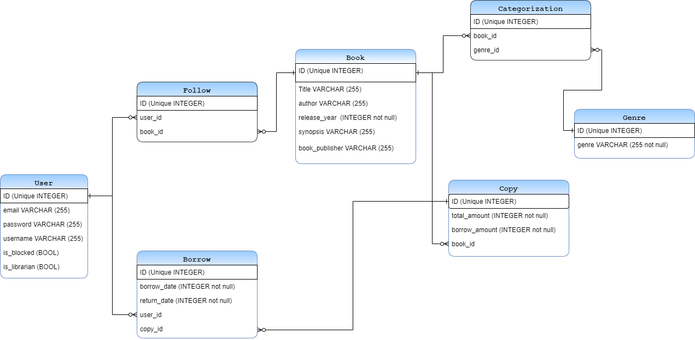

<h1> ReadIn Books</h1>

## **1. Project** 

 This application is a online library system, where each book can only be borrowed for a fixed period of time. There are CRUD of employees, users, books, genres, and this is just the first page.

 ## <strong>ER Diagram: </strong>
 <br><br>


 Main technologies used:

 - Python
 - Django
 
 **Base URL: https://bibliotekag-30.onrender.com**

 **Documentation:**
 
 https://bibliotekag-30.onrender.com/api/schema/
 
 https://bibliotekag-30.onrender.com/api/docs/swagger/

 ## **Devs**

 > - [Amanda R. Costa](https://www.linkedin.com/in/amanda-fullstack/)
 > - [Igor Dias](https://www.linkedin.com/in/igord934/) 
 > - [Igor Ramon](https://www.linkedin.com/in/igor-ramon-rio-tinto/)
 > - [Vinicius Pacheco](https://www.linkedin.com/in/viniciusgrp/)

 ## **2. Start the project:**
 ### Type the command in the terminal:

```json
  pip install -r requirements.txt
 ```
